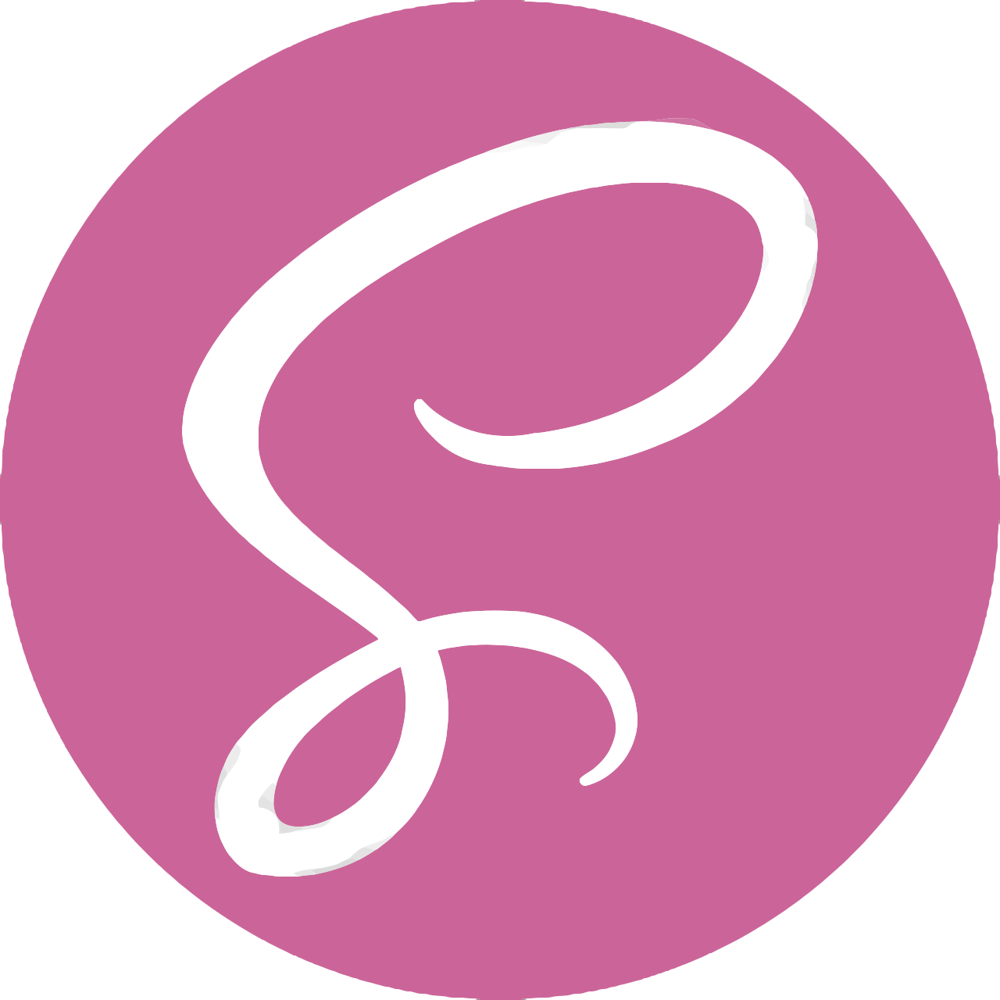
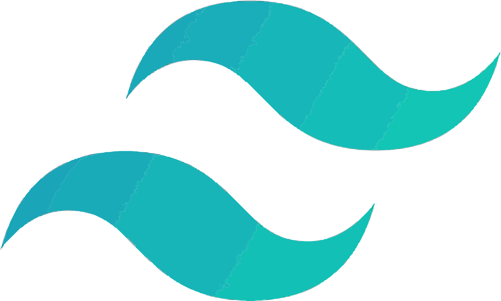
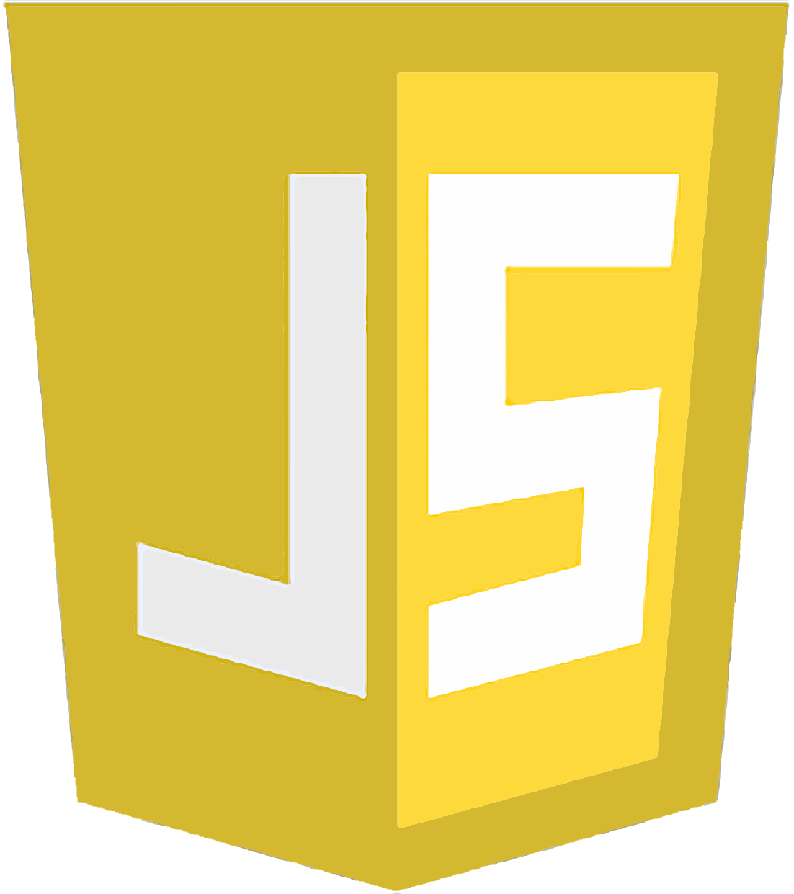

<!---
Erik-42/Erik-42 is a ✨ special ✨ repository because its `README.md` (this file) appears on your GitHub profile.
You can click the Preview link to take a look at your changes.
--->

      
[![GitHub followers][GitHub followers-shield]][GitHub followers-url]
[![Stargazers][stars-shield]][stars-url]
[![GitHub repo][GitHub repo-shield]][GitHub repo-url]

[![wakatime][wakatime-shield]][wakatime-url]

<!-- [![Contributors][contributors-shield]][contributors-url] -->
<!-- [![Forks][forks-shield]][forks-url] -->
<!-- [![Issues][issues-shield]][issues-url] -->
<!-- [![MIT License][license-shield]][license-url] -->
<!-- [![GitHub repo file count (file type)][GitHub repo file count (file type)-shield]][GitHub repo file count (file type)-url] -->
<!-- [![GitHub repo size][GitHub repo size-shield]][GitHub repo size-url] -->
<!-- [![GitHub all releases][GitHub all releases-shield]][GitHub all releases-url] -->

- 👋 Hi, I’m @ Erik Mesen
- 👀 I’m interested in IT in general and the development of applications.
  I'm also very attracted by cyber security, OSINT and pentest but also by artificial intelligence.
- 🌱 I’m currently learning at OpenClassRoom.
- 💞️ I’m looking to collaborate on differeents frontend an backend projects in order to improve my skills.
- 📫 How to reach me <a href="#contact">Contact</a>
- 🌐 My website : [portfolio](https://basillecorp.dev)

<!-- PROJECT LOGO -->
 

  <h1>Work</h1>
  

<!-- TABLE OF CONTENTS -->

  
Table of Contents

  <ol>
    <li><a href="#bio">Bio</a>
      <ul>
        <li><a href="#français">Français</a></li> 
        <li><a href="#english">English</a></li>
      </ul>
    </li>
    <li><a href="#skills">Skills</a></li>
    <li><a href="#certificate">Certificate</a></li>
    <li><a href="#works">Works</a></li>
    <li><a href="#contact">Contact</a></li>
  </ol>

# Bio

### Français

Je suis passionné d’informatique et autodidacte dans le domaine depuis ma plus tendre enfance. Je suis de cette génération qui a connus les premiers ordinateurs et grandit avec, petit je passais des heures à démonter, remonter et paramétrer les miens pour en comprendre le fonctionnement.

Ce qui m'a motivé aujourd’hui à me reconvertir dans ce domaine, outre la passion qui m’anime, c’est la soif de savoir, de curiosité et de création, dans le développement d'applications frontend et backend.

Je maitrise également l'installation, la maintenance de serveurs et de réseaux aussi bien physique que virtuels ainsi que leurs configuration.

Je suis également très attiré par la cybersécurité sous ces différents aspect comme l'OSINT ou le pentest ainsi que par les intelligence artificielles et leurs progrès fulgurants ces dernières années.

### English

I am passionate about computers and self-taught in the field since my childhood. I am of this generation who knew the first computers and grew up with them, I spent hours dismantling, reassembling and configuring mine to understand how it worked.

What motivated me today to retrain in this field in addition to the passion that drives me is the thirst for knowledge, curiosity and creation, in the development of frontend and backend applications.

I also master the installation, maintenance of physical and virtual servers and networks as well as their configuration.

I am also very attracted by cybersecurity in its various aspects such as OSINT or pentest as well as by artificial intelligence and its dazzling progress in recent years.

# Skills

<!---->

 

(<a href="#readme-top">back to top</a>)

# Certificate

<a href="#">
 
Développeur intégrateur web (OpenClassRoom)
 
       
  </a>
  
 <a href="https://openbadgepassport.com/app/badge/info/611598">
 
Python : Des fondamentaux aux concepts avancés (INRIA)
 
       
  </a>

(<a href="#readme-top">back to top</a>)

# Works

<h3> Stuff I worked on last week  
 
</h3>

 

<h3> My GitHub Stats 
 
</h3>

(<a href="#readme-top">back to top</a>)

<!-- CONTACT -->

# Contact

<!---->

      

 

  
[![Github Badge][Github Badge-shield]][Github Badge-url]
[![LinkedIn][linkedin-shield]][linkedin-url]
 

  
 

 

buymeacoffee.com/meseneriko

      

(<a href="#readme-top">back to top</a>)

<!-- MARKDOWN LINKS & IMAGES -->
<!-- https://www.markdownguide.org/basic-syntax/#reference-style-links -->

[product-screenshot]: ./images/screenshot.png
[Python Badge-shield]: https://openbadgepassport.com/app/badge/info/611598/pic/embed
[Python Badge-url]: https://openbadgepassport.com/app/badge/info/611598
[wakatime-shield]: https://wakatime.com/badge/user/f84d00d8-fee3-4ca3-803d-3daa3c7053a5.svg
[wakatime-url]: https://wakatime.com/@f84d00d8-fee3-4ca3-803d-3daa3c7053a5
[Github Badge-shield]: https://img.shields.io/badge/Github-Erik--42-155?style=for-the-badge&logo=github
[Github Badge-url]: https://github.com/Erik-42
[GitHub repo-shield]: https://img.shields.io/badge/Repositories-59-blue
[GitHub repo-url]: https://github.com/Erik-42?tab=repositories
[GitHub followers-shield]: https://img.shields.io/github/followers/Erik-42
[GitHub followers-url]: https://github.com/followers/Erik-42
[stars-shield]: https://img.shields.io/github/stars/Erik-42
[stars-url]: https://github.com/Erik-42?tab=stars
[linkedin-shield]: https://img.shields.io/badge/-LinkedIn-black.svg?style=for-the-badge&logo=linkedin&colorB=555
[linkedin-url]: https://www.linkedin.com/in/erik-mesen/
[HTML-shield]: https://img.shields.io/badge/-LinkedIn-black.svg?style=for-the-badge&logo=linkedin&colorB=555
[HTML-url]: https://html.spec.whatwg.org/
[CSS-shield]: https://img.shields.io/badge/-LinkedIn-black.svg?style=for-the-badge&logo=linkedin&colorB=555
[CSS-url]: https://www.w3.org/TR/CSS/#css
[Tailwind-shield]: https://img.shields.io/badge/-LinkedIn-black.svg?style=for-the-badge&logo=linkedin&colorB=555
[Tailwind-url]: https://www.w3.org/TR/CSS/#css
[JavaScript-shield]: https://img.shields.io/badge/-LinkedIn-black.svg?style=for-the-badge&logo=linkedin&colorB=555
[JavaScript-url]: https://www.ecma-international.org/publications-and-standards/standards/ecma-262/
[Node-shield]: https://img.shields.io/badge/-LinkedIn-black.svg?style=for-the-badge&logo=linkedin&colorB=555
[Node-url]: https://nodejs.org/
[Express-shield]: https://img.shields.io/badge/-LinkedIn-black.svg?style=for-the-badge&logo=linkedin&colorB=555
[Express-url]: http://expressjs.com/
[MongoDB-shield]: https://img.shields.io/badge/-LinkedIn-black.svg?style=for-the-badge&logo=linkedin&colorB=555
[MongoDB-url]: https://www.mongodb.com/
