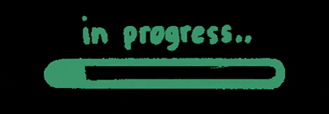
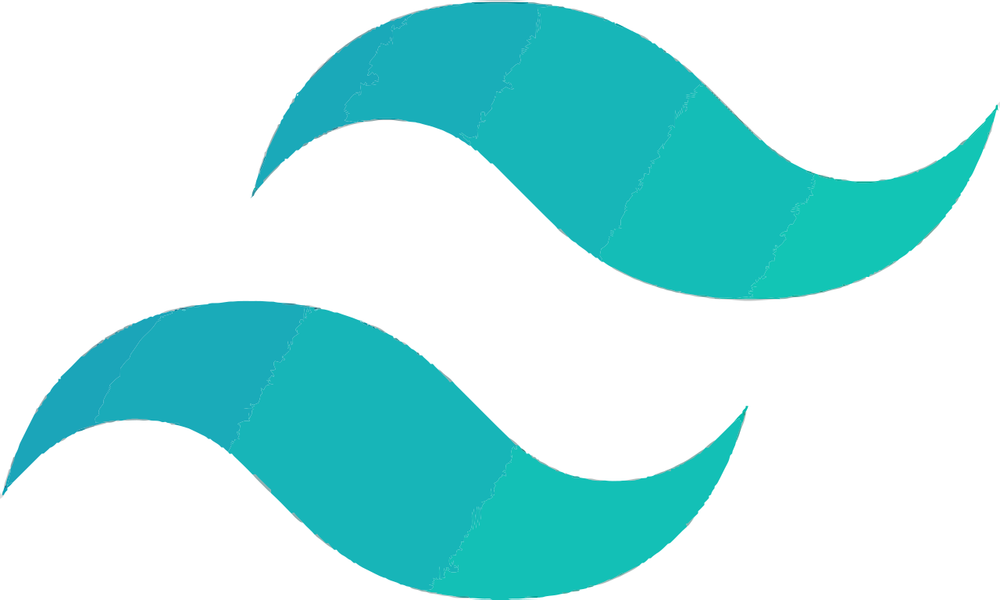
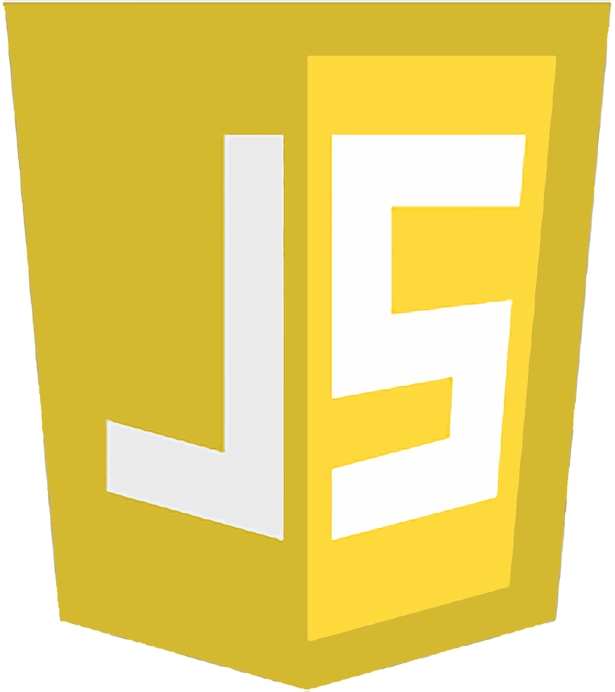
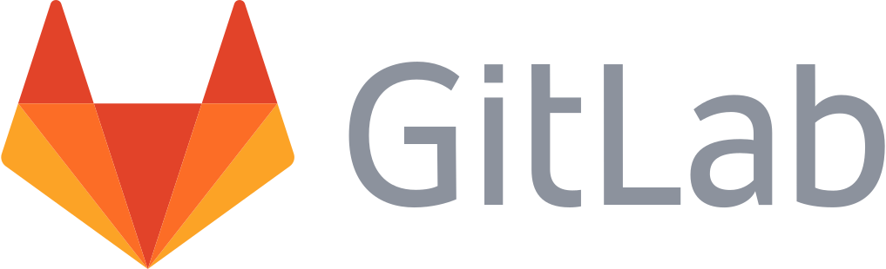

<!---
Erik-42/Erik-42 is a ✨ special ✨ repository because its `README.md` (this file) appears on your GitHub profile.
You can click the Preview link to take a look at your changes.
--->

      
[![GitHub followers][GitHub followers-shield]][GitHub followers-url]
[![Stargazers][stars-shield]][stars-url]
[![GitHub repo][GitHub repo-shield]][GitHub repo-url]

[![wakatime][wakatime-shield]][wakatime-url]

<!-- [![Contributors][contributors-shield]][contributors-url] -->
<!-- [![Forks][forks-shield]][forks-url] -->
<!-- [![Issues][issues-shield]][issues-url] -->
<!-- [![MIT License][license-shield]][license-url] -->
<!-- [![GitHub repo file count (file type)][GitHub repo file count (file type)-shield]][GitHub repo file count (file type)-url] -->
<!-- [![GitHub repo size][GitHub repo size-shield]][GitHub repo size-url] -->
<!-- [![GitHub all releases][GitHub all releases-shield]][GitHub all releases-url] -->

- 👋 Hi, I’m @ Erik Mesen
- 👀 I’m interested in IT in general and the development of applications.
  I'm also very attracted by cyber security, OSINT and pentest but also by artificial intelligence.
- 🌱 I’m currently learning at OpenClassRoom.
- 💞️ I’m looking to collaborate on differeents frontend an backend projects in order to improve my skills.
- 📫 How to reach me <a href="#contact">Contact</a>
- 🌐 My website : [portfolio](https://basillecorp.dev)

<!-- PROJECT LOGO -->
 

  <h1>Work</h1>
  

<!-- TABLE OF CONTENTS -->

  
Table of Contents

  <ol>
    <li><a href="#bio">Bio</a>
      <ul>
        <li><a href="#français">Français</a></li> 
        <li><a href="#english">English</a></li>
      </ul>
    </li>
    <li><a href="#skills">Skills</a></li>
    <li><a href="#certificate">Certificate</a></li>
    <li><a href="#works">Works</a></li>
    <li><a href="#contact">Contact</a></li>
  </ol>

# Bio

### Français

Je suis passionné d’informatique et autodidacte depuis mon plus jeune âge. J’ai grandi avec les premiers ordinateurs, en les démontant, configurant et optimisant pour en comprendre le fonctionnement.

Aujourd’hui, je suis **développeur et concepteur logiciel certifié**, spécialisé dans la création d’applications web et l’architecture technique.

🎓 Diplômes :
- **Concepteur Développeur d’Applications** — RNCP niveau 6 (équivalent Licence)
- **Développeur Web et Web Mobile** — RNCP niveau 5 (équivalent BTS)

Je possède également de solides compétences en **administration systèmes et réseaux**, ainsi qu’un fort intérêt pour la **cybersécurité (OSINT, pentest)** et l’**intelligence artificielle**.

---

### English

I am passionate about computers and have been self-taught since childhood, building and optimizing systems to understand how they work.

Today, I am a **certified software developer and designer**, focused on building web applications and designing robust architectures.

🎓 Certifications:
- **Application Developer & Software Designer** — RNCP Level 6
- **Web & Web Mobile Developer** — RNCP Level 5

I also have strong experience in **system and network administration**, with a growing interest in **cybersecurity** and **artificial intelligence**.

---

# Skills

## 💻 Frontend

## 🧩 Backend

## 🗄️ Database

## ⚙️ DevOps & Infrastructure

- Linux (administration serveur)
- Virtualisation & réseaux

## 🎨 Tools & CMS

(<a href="#readme-top">back to top</a>)

---

(<a href="#readme-top">back to top</a>)

# Certificate

<a href="#">
 
Développeur intégrateur web
 
       
  </a>

  <a href="#">
 
Concepteur logiciels
 
       
  </a>
  
 <a href="https://openbadgepassport.com/app/badge/info/611598">
 
Python : Des fondamentaux aux concepts avancés (INRIA)
 
       
  </a>

(<a href="#readme-top">back to top</a>)

# Works

<h3> Stuff I worked on last week  
 
</h3>

 

<h3> My GitHub Stats 
 
</h3>

(<a href="#readme-top">back to top</a>)

<!-- CONTACT -->

# Contact

<!---->

      

 

  
[![Github Badge][Github Badge-shield]][Github Badge-url]
[![LinkedIn][linkedin-shield]][linkedin-url]
 

  
 

 

https://buymeacoffee.com/meseneriko

      

(<a href="#readme-top">back to top</a>)

<!-- MARKDOWN LINKS & IMAGES -->
<!-- https://www.markdownguide.org/basic-syntax/#reference-style-links -->

[product-screenshot]: ./images/screenshot.png
[Python Badge-shield]: https://openbadgepassport.com/app/badge/info/611598/pic/embed
[Python Badge-url]: https://openbadgepassport.com/app/badge/info/611598
[wakatime-shield]: https://wakatime.com/badge/user/f84d00d8-fee3-4ca3-803d-3daa3c7053a5.svg
[wakatime-url]: https://wakatime.com/@f84d00d8-fee3-4ca3-803d-3daa3c7053a5
[Github Badge-shield]: https://img.shields.io/badge/Github-Erik--42-155?style=for-the-badge&logo=github
[Github Badge-url]: https://github.com/Erik-42
[GitHub repo-shield]: https://img.shields.io/badge/Repositories-130-blue
[GitHub repo-url]: https://github.com/Erik-42?tab=repositories
[GitHub followers-shield]: https://img.shields.io/github/followers/Erik-42
[GitHub followers-url]: https://github.com/followers/Erik-42
[stars-shield]: https://img.shields.io/github/stars/Erik-42
[stars-url]: https://github.com/Erik-42?tab=stars
[linkedin-shield]: https://img.shields.io/badge/-LinkedIn-black.svg?style=for-the-badge&logo=linkedin&colorB=555
[linkedin-url]: https://www.linkedin.com/in/erik-mesen/
[HTML-shield]: https://img.shields.io/badge/-LinkedIn-black.svg?style=for-the-badge&logo=linkedin&colorB=555
[HTML-url]: https://html.spec.whatwg.org/
[CSS-shield]: https://img.shields.io/badge/-LinkedIn-black.svg?style=for-the-badge&logo=linkedin&colorB=555
[CSS-url]: https://www.w3.org/TR/CSS/#css
[Tailwind-shield]: https://img.shields.io/badge/-LinkedIn-black.svg?style=for-the-badge&logo=linkedin&colorB=555
[Tailwind-url]: https://www.w3.org/TR/CSS/#css
[JavaScript-shield]: https://img.shields.io/badge/-LinkedIn-black.svg?style=for-the-badge&logo=linkedin&colorB=555
[JavaScript-url]: https://www.ecma-international.org/publications-and-standards/standards/ecma-262/
[Node-shield]: https://img.shields.io/badge/-LinkedIn-black.svg?style=for-the-badge&logo=linkedin&colorB=555
[Node-url]: https://nodejs.org/
[Express-shield]: https://img.shields.io/badge/-LinkedIn-black.svg?style=for-the-badge&logo=linkedin&colorB=555
[Express-url]: http://expressjs.com/
[MongoDB-shield]: https://img.shields.io/badge/-LinkedIn-black.svg?style=for-the-badge&logo=linkedin&colorB=555
[MongoDB-url]: https://www.mongodb.com/
